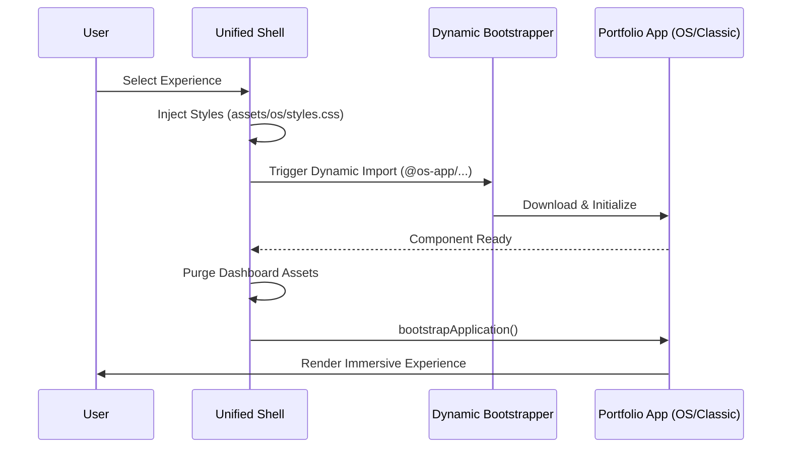

# 🌌 UnifiedShell v3.0.1-Neural

<p align="center">
  
  
  
  
</p>

> **The Neural Gateway to the Naveen Singh Portfolio Ecosystem.**

UnifiedShell is a cutting-edge, micro-frontend-inspired Angular orchestration layer that unifies multiple immersive portfolio experiences into a single, high-performance interface. It serves as a dynamic bootstrap engine, allowing users to switch between a desktop-inspired OS environment and an immersive classic storytelling mode seamlessly.

---

## 🚀 Vision & Architecture

UnifiedShell isn't just a wrapper; it's a **Dynamic Runtime Orchestrator**. It manages the lifecycle of entire standalone applications within a single DOM context.

### Dynamic Orchestration Flow


### Advanced Core Concepts
- **Micro-Frontend Pattern**: Integrates independent portfolio applications (`Naveen OS` and `Classic Mode`) as external modules resolved via TypeScript path aliases and dynamic imports.
- **Zoneless Reactivity**: Leverages Angular 21's `provideZonelessChangeDetection()` to eliminate the overhead of Zone.js, resulting in faster execution and smaller bundles.
- **Dynamic Bootstrapping**: Programmatically calls `bootstrapApplication` at runtime to instantiate and destroy entire application contexts without page refreshes.
- **Neural Dashboard**: A central hub featuring high-frequency WebGL effects, custom interaction protocols, and a simulated "boot sequence".

---

## 🛠 Tech Stack

| Layer | Technologies |
| :--- | :--- |
| **Core Framework** | **Angular 21** (Standalone Components, Zoneless Signals) |
| **State Management** | **@ngrx/signals** (Reactive Signal-based state) |
| **Visuals & VFX** | **WebGL (Canvas API)**, **CSS Conic Gradients**, **GSAP-like Animations** |
| **Hydration** | **Angular Client Hydration** (Optimized LCP & SEO) |
| **Testing** | **Vitest**, JSDOM Integration Testing |
| **Utilities** | **Mermaid.js**, **Pinch Zoom**, **JetBrains Mono** |

---

## ✨ Key Features

### 1. Neural Interface Dashboard
A high-fidelity entry point with:
- **Boot Sequence Protocol**: Interactive log-based loading screen with system integrity checks.
- **Adaptive VFX**: Aurora background, mouse-trailing particle systems, and holographic card effects.
- **Custom Cursor Engine**: A reactive, multi-state cursor that bridges the gap between the user and the system.

### 2. Dual-Experience Integration
- **Naveen OS**: A windowing-system-based desktop environment with native app simulations.
- **Classic Mode**: A story-driven, high-performance scrolling experience with advanced typography and CLI components.

### 3. Dynamic Asset Pipeline
The shell dynamically injects and purges stylesheets (`assets/os/styles.css` vs `assets/classic/styles.css`) during application switching to ensure zero style leakage and optimized performance.

---

## 🏗 Project Structure

```text
unified-shell/
├── external/               # Integrated apps (mirrored from sibling projects)
│   ├── os-app/             # Naveen OS Source (@os-app/*)
│   └── classic-app/        # Classic Portfolio Source (@classic-app/*)
├── src/
│   ├── app/
│   │   ├── components/
│   │   │   └── dashboard/  # Neural Interface Hub
│   │   ├── app.ts          # Orchestration Logic (Bootstrapper)
│   │   └── app.config.ts   # Zoneless Configuration & Providers
│   └── styles.css          # Global Neural Reset & Scroll Control
├── test-runtime.js         # Headless JSDOM Smoke Tests
└── angular.json            # Multi-project Asset Mapping
```

---

## 🛠 Development Workflow

### Detailed Command Palette

| Command | Action |
| :--- | :--- |
| `npm start` | Launches development server with external app mirroring. |
| `npm run build` | Compiles the shell and all integrated portfolios. |
| `npm run prebuild` | Synchronizes external apps from sibling directories. |
| `npm run test` | Executes the Vitest unit testing suite. |
| `node test-runtime.js`| Runs the JSDOM headless integration smoke test. |

### Integration Strategy
The shell uses `tsconfig.json` path aliases to treat external apps as internal modules, enabling seamless type safety across boundaries.

---

## 🧪 Quality Assurance

### Vitest Unit Testing
Modern, blazing-fast unit testing with Vitest:
```bash
npm run test
```

### Integration Smoke Tests
We use custom JSDOM-based runtime tests to ensure the bundled application boots correctly in a headless environment:
```bash
# Requires a successful build first
node test-runtime.js
```

---

## 📡 Systems Status
- **Current Build**: `v3.0.1-Neural`
- **Change Detection**: `Zoneless (Signal-Driven)`
- **Hydration State**: `Active`
- **Integrity**: `Verified`

---
<p align="center">
  <em>Developed by Naveen Singh. Part of the Unified Portfolio Ecosystem.</em>
</p>
